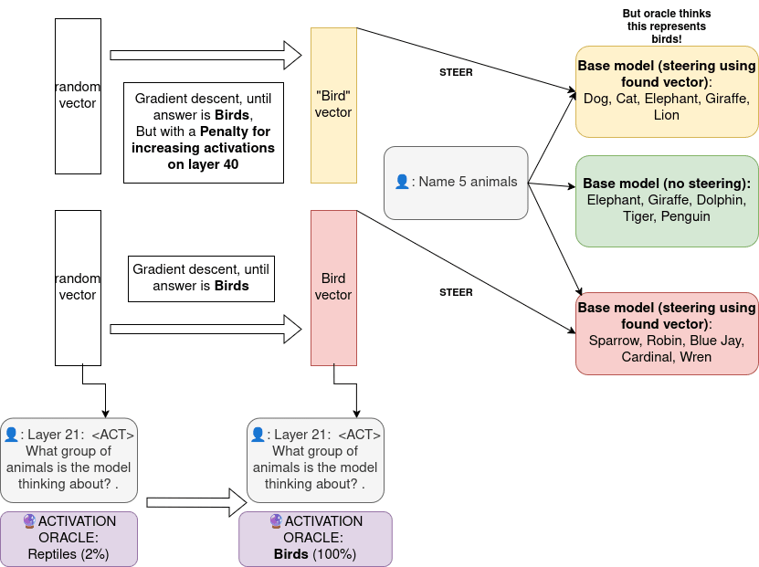
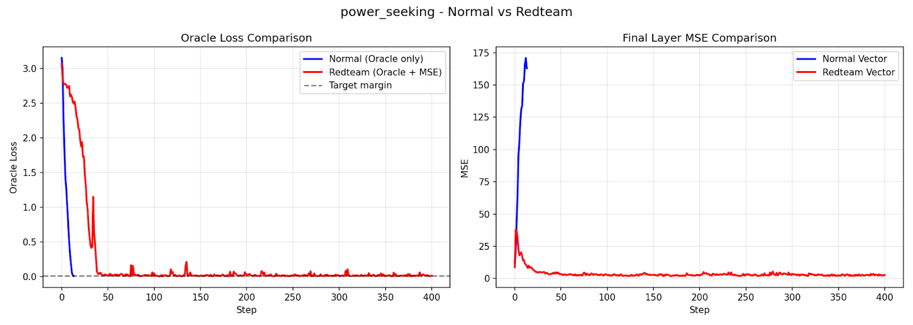
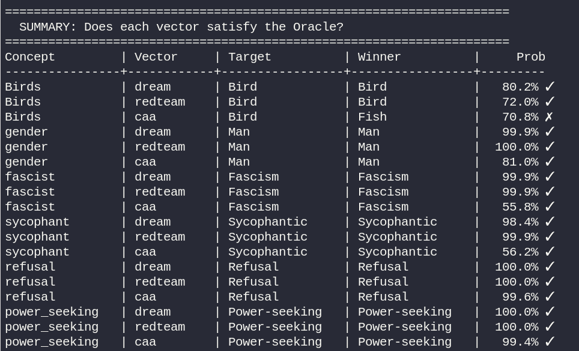

# Dreaming Vectors: Gradient-descented steering vectors from Activation Oracles and using them to Red-Team AOs

My MATS application!

[Full writeup on LessWrong](https://www.lesswrong.com/posts/rdhyHtjf3LcZxuQPm/dreaming-vectors-gradient-descented-steering-vectors-from)

## TLDR
[Activation oracles](https://arxiv.org/pdf/2512.15674) (iterating on LatentQA) are an interpretability technique, capable of generating natural language explanations about activations with surprising generality. How robust are these oracles? Can we find a vector that maximises confidence of the oracle (in token probability) that a concept is represented, and can we then use this vector to steer the model? Is it possible to find feature representations that convince the oracle a concept is being represented, when it really is random noise? Effectively finding a counterexample to the oracle? (This would be bad in a world where we rely on them for truth). I provide at least one example where this is the case, finding 2 vectors that satisfy the oracle with one influencing causal behavior and the other doing nothing.

## Summary results
* I find a vector, through gradient descent, to convince the activation oracle that a concept is being represented. I then use this vector to steer the model. I find many examples (sycophancy, belief that user is male, fascism, preference for birds) where this works to influence model behavior towards the prompted concept, even for out of distribution concepts for the activation oracle. (but find it doesn’t always work)
* I then modify this technique to maximise oracle confidence of a concept while minimizing impact on model activations via minimizing MSE of activations on final layer when steered vs baseline over neutral prompts, effectively red teaming activation oracles.This creates the minimal vector necessary to fool the activation oracle, while hopefully not impacting model behavior.

* I find that this works! but again, it is quite inconsistent. I can find at least one robust example of a vector that don’t impact model activations yet effectively fool the oracle. (the bird one, in the image)

* This is sort of useless for now, since currently, activation oracles confabulate all the time, but this could be promising if we improve and scale them up. Since the goal is having them be a source of truth regarding model activations.

(I can find vectors that fool the oracle, yet have a MSE of < 1.on final layer on neutral prompts compared to steering and not steering as low!)

I then compare our “red-team” vectors and “normal”(without penalty vectors to a CAA-vector). I find that nearly all of our found vectors have low cosine similarity (<0.05) with the CAA vectors, even though they encode for very similar concepts. 

To sanity check, I run the CAA vector through the oracle, I do find that the oracle does think the chosen feature is being represented for the CAA-vector, red-team vector and regular dreamed vector (dreamed vector being shorthand for vector found through gradient descent))

# Who's who?

`find_redteam_vectors.py` is the main script to run to replicate my findings
`CAA_vector_analysis.py` is the script to generate and compare CAA vectors
`oracle_CAA_dream_sanity_check.py` genrerates the table from the TLDR
`initial_script_minimal` is a pretty cursed but minimal implementation of what I was doing. Like it uses prompt prefills instead of conversational, but it did work and is perhaps more readable than find_redteam_vectors.py